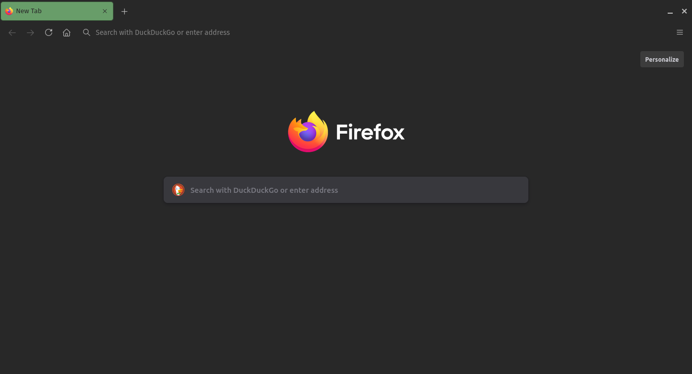
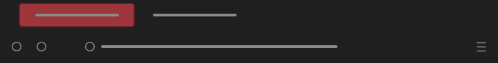
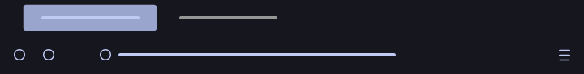

# MinimalistFox

Borderless, minimalist Firefox themes with single coloured active tabs and highlights.



<br/>

## List of themes

### Minimalist Dark and Green Tabs


```Colours in use: Black: #282828, Grey: #aaaaaa, Green: #689d69```

Green active tabs and highlights. Inspired by [gruvbox](https://github.com/morhetz/gruvbox). Available on [Firefox Add-ons](https://addons.mozilla.org/en-US/firefox/addon/minimalist-dark-and-green-tabs/).

<br/>

### Minimalist Dark and Red Tabs



```Colours in use: Black: #1f1f1f, Grey: #8a8a8a, Red: #9d353a```

Red active tabs and highlights. Inspired by [gruvbox](https://github.com/morhetz/gruvbox). Available on [Firefox Add-ons](https://addons.mozilla.org/en-US/firefox/addon/minimalist-dark-and-red-tabs/).

<br/>

### Minimalist Dark and Blue Tabs


```Colours in use: Black: #2b303c, Light Grey: #c5c5c7, Blue: #81a1c1```

Blue active tabs and highlights. Inspired by [Nord colour palette](https://github.com/arcticicestudio/nord). Available on [Firefox Add-ons](https://addons.mozilla.org/en-US/firefox/addon/minimalist-dark-and-blue-tabs/).

<br/>

### Minimalist Dark and Purple Tabs


```Colours in use: Black: #1e1f29, Grey: #aaaaaa, Purple: #725e97```

Purple active tabs and highlights. Inspired by [Dracula-GTK](https://github.com/dracula/gtk). Available on [Firefox Add-ons](https://addons.mozilla.org/en-US/firefox/addon/minimalist-dark-and-purple-tab/).

<br/>

### Minimalist Dark and Yellow Tabs


```Colours in use: Black: #181b1e, Shadow Green: #9fbfb7, Yellow: #c1af58, Coral Pink: #c1585a```

Yellow active tabs and pink highlights. Inspired by [Sweet Mars theme](https://github.com/EliverLara/Sweet). Available on [Firefox Add-ons](https://addons.mozilla.org/en-US/firefox/addon/minimalist-dark-and-yellow-tab/).

<br/>

### Minimalist Tokyo Night



```Colours in use: Black: #16161e, Pale Blue: #9aa5ce, Lavender Blue: #c0caf5, Grey: #969696, Brown Yellow: #e0af68, Light Crimson: #f7768e, Pistachio: #9ece6a```

Pale blue active tabs and yellow highlights. Based on [Tokyo Night](https://github.com/enkia/tokyo-night-vscode-theme). Available on [Firefox Add-ons](https://addons.mozilla.org/en-US/firefox/addon/minimalist-tokyo-night/).

