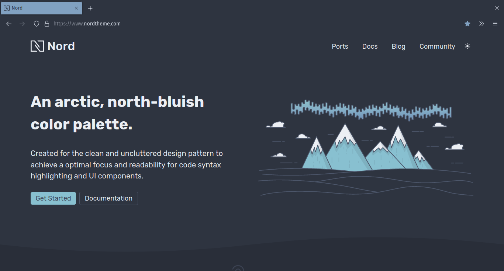
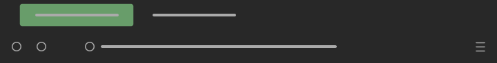
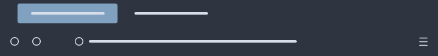
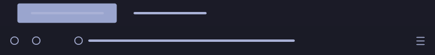
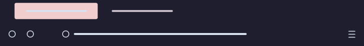
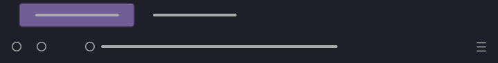
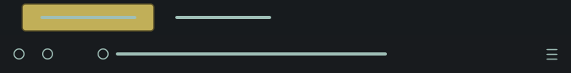

MinimalistFox
====

Minimalist Firefox themes based on popular colour schemes.

<br/>





<br/>

# List of themes

- [Minimalist Gruvbox](#minimalist-gruvbox)
- [Minimalist Nord](#minimalist-nord)
- [Minimalist Tokyo Night](#minimalist-tokyo-night)
- [Minimalist Catppuccin](#minimalist-catppuccin)
- [Minimalist Dark and Red Tabs](#minimalist-dark-and-red-tabs)
- [Minimalist Dark and Purple Tabs](#minimalist-dark-and-purple-tabs)
- [Minimalist Dark and Yellow Tabs](#minimalist-dark-and-yellow-tabs)
- [Minimalist Black and Grey Tabs](#minimalist-black-and-grey-tabs)
- [Tokyo Night Colour](#tokyo-night-colour)
- [Dracula Colour](#dracula-colour)

<br/>

### Minimalist Gruvbox



```Colours in use: Black: #282828, Grey: #aaaaaa, Aqua: #689d6a```

Aqua active tabs and highlights. Based on [gruvbox](https://github.com/morhetz/gruvbox). Available on [Firefox Add-ons](https://addons.mozilla.org/en-US/firefox/addon/minimalist-gruvbox).

<br/>

### Minimalist Nord



```Colours in use: Black: #2e3440, White: #d8dee9, Blue: #81a1c1```

Blue active tabs and highlights. Based on [Nord](https://github.com/arcticicestudio/nord). Available on [Firefox Add-ons](https://addons.mozilla.org/en-US/firefox/addon/minimalist-nord/).

<br/>

### Minimalist Tokyo Night



```Colours in use: Black: #1a1b26, Blue: #a9b1d6, #9aa5ce, Yellow: #e0af68, Red: #f7768e, Green: #9ece6a```

Pale blue active tabs with yellow highlights. Based on [Tokyo Night](https://github.com/enkia/tokyo-night-vscode-theme). Available on [Firefox Add-ons](https://addons.mozilla.org/en-US/firefox/addon/minimalist-tokyo-night/).

<br/>

### Minimalist Catppuccin



```Colours in use: Black: #1e1e2e, White: #d9e0ee, Grey: #c3bac6, Pale Pink: #f2cdcd, Teal: #b5e8e0```

Pale pink active tabs with teal highlights. Based on [Catppuccin](https://github.com/catppuccin). Available on [Firefox Add-ons](https://addons.mozilla.org/en-US/firefox/addon/minimalist-catppuccin/).

<br/>

### Minimalist Dark and Red Tabs


```Colours in use: Black: #1f1f1f, Grey: #8a8a8a, Red: #9d353a```

Red active tabs and highlights. Inspired by [gruvbox](https://github.com/morhetz/gruvbox). Available on [Firefox Add-ons](https://addons.mozilla.org/en-US/firefox/addon/minimalist-dark-and-red-tabs/).

<br/>

### Minimalist Dark and Purple Tabs



```Colours in use: Black: #1e1f29, Grey: #aaaaaa, Purple: #725e97```

Purple active tabs and highlights. Inspired by [Dracula-GTK](https://github.com/dracula/gtk). Available on [Firefox Add-ons](https://addons.mozilla.org/en-US/firefox/addon/minimalist-dark-and-purple-tab/).

<br/>

### Minimalist Dark and Yellow Tabs



```Colours in use: Black: #181b1e, Shadow Green: #9fbfb7, Yellow: #c1af58, Coral Pink: #c1585a```

Yellow active tabs with pink highlights. Inspired by [Sweet Mars theme](https://github.com/EliverLara/Sweet). Available on [Firefox Add-ons](https://addons.mozilla.org/en-US/firefox/addon/minimalist-dark-and-yellow-tab/).

<br/>

### Minimalist Black and Grey Tabs


```Colours in use: Black: #000000, Grey: #808080```

Grey active tabs and highlights. Available on [Firefox Add-ons](https://addons.mozilla.org/en-US/firefox/addon/minimalist-black-and-grey-tabs/).

<br/>

### Tokyo Night Colour


```Colours in use: Black: #1a1b26, White: #a9b1d6, Blue: #7aa2f7, Yellow: #e0af68, Red: #f7768e, Purple: #bb9af7, Green: #9ece6a```

Blue toolbar and active tabs with yellow highlights. Based on [Tokyo Night](https://github.com/enkia/tokyo-night-vscode-theme). Available on [Firefox Add-ons](https://addons.mozilla.org/en-US/firefox/addon/tokyo-night-colour/).

<br/>

### Dracula Colour


```Colours in use: Black: #282a36, White: #f8f8f2, Purple: #bd93f9, Green: #50fa7b, Pink: #ff79c6, Yellow: #f1fa8c, Cyan: #8be9fd```

Purple toolbar and active tabs with green highlights. Based on [Dracula](https://github.com/dracula/dracula-theme). Available on [Firefox Add-ons](https://addons.mozilla.org/en-US/firefox/addon/dracula-colour/).
