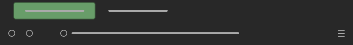
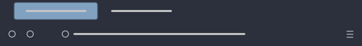
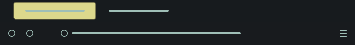

# MinimalistFox

Borderless, minimalist Firefox themes with single coloured active tabs and highlights.

<br/>

## List of themes

### Minimalist Dark and Green Tabs



```Colours in use: Black: #282828, Grey: #aaaaaa, Green: #689d69```

Green active tabs and highlights. Inspired by [Orchis-theme](https://github.com/vinceliuice/Orchis-theme). Theme [link](https://addons.mozilla.org/en-US/firefox/addon/minimalist-dark-and-green-tabs/) from Firefox add-ons.

<br/>

### Minimalist Dark and Blue Tabs



```Colours in use: Black: #2b303c, Light Grey: #c5c5c7, Blue: #81a1c1```

Blue active tabs and highlights. Inspired by [Nord-colour palette](https://github.com/arcticicestudio/nord). Theme [link](https://addons.mozilla.org/en-US/firefox/addon/minimalist-dark-and-blue-tabs/) from Firefox add-ons.

<br/>

### Minimalist Dark and Purple Tabs


```Colours in use: Black: #1e1f29, Grey: #aaaaaa, Purple: #725e97```

Purple active tabs and highlights. Inspired by [Dracula-Gtk](https://github.com/dracula/gtk). Theme [link](https://addons.mozilla.org/en-US/firefox/addon/minimalist-dark-and-purple-tab/) from Firefox add-ons.

<br/>

### Minimalist Dark and Yellow Tabs



```Colours in use: Black: #181b1e, Shadow Green: #9fbfb7, Yellow: #dcd88c, Red: #f6867c```

Yellow active tabs and red highlights. Inspired by [Sweet Mars theme](https://github.com/EliverLara/Sweet). Theme [link](https://addons.mozilla.org/en-US/firefox/addon/minimalist-dark-and-yellow-tab/) from Firefox add-ons.

