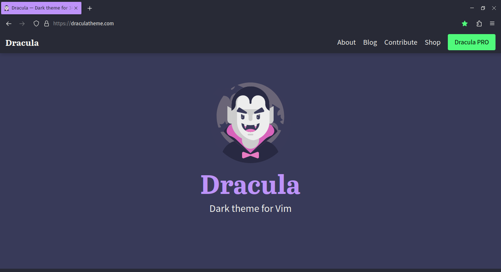
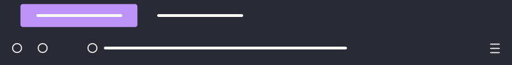
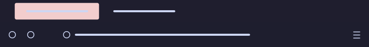
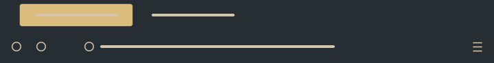

MinimalistFox
====

Minimalist Firefox themes based on popular colour schemes.

<br/>




<br/>

# List of themes

- [Minimalist Gruvbox](#minimalist-gruvbox)
- [Minimalist Nord](#minimalist-nord)
- [Minimalist Dracula](#minimalist-dracula)
- [Minimalist Tokyo Night](#minimalist-tokyo-night)
- [Minimalist Catppuccin](#minimalist-catppuccin)
- [Minimalist One Dark](#minimalist-one-dark)
- [Minimalist Everforest](#minimalist-everforest)
- [Minimalist Black and Grey Tabs](#minimalist-black-and-grey-tabs)

<br/>

### Minimalist Gruvbox


```Colours in use: Black: #282828, Grey: #aaaaaa, Green: #689d6a```

Aqua active tabs and highlights. Based on [gruvbox](https://github.com/morhetz/gruvbox). Available on [Firefox Add-ons](https://addons.mozilla.org/en-US/firefox/addon/minimalist-gruvbox).

<br/>

### Minimalist Nord


```Colours in use: Black: #2e3440, White: #d8dee9, Blue: #81a1c1```

Blue active tabs and highlights. Based on [Nord](https://github.com/arcticicestudio/nord). Available on [Firefox Add-ons](https://addons.mozilla.org/en-US/firefox/addon/minimalist-nord/).

<br/>

### Minimalist Dracula



```Colours in use: Black: #282a36, White: #f8f8f2, Purple: #bd93f9, Green: #50fa7b```

Purple active tabs and highlights. Based on [Dracula](https://github.com/dracula/dracula-theme). Available on [Firefox Add-ons](https://addons.mozilla.org/en-US/firefox/addon/minimalist-dracula/).

<br/>

### Minimalist Tokyo Night


```Colours in use: Black: #1a1b26, White: #a9b1d6, Blue: #9aa5ce, Yellow: #e0af68, Red: #f7768e, Green: #9ece6a```

Pale blue active tabs with yellow highlights. Based on [Tokyo Night](https://github.com/enkia/tokyo-night-vscode-theme). Available on [Firefox Add-ons](https://addons.mozilla.org/en-US/firefox/addon/minimalist-tokyo-night/).

<br/>

### Minimalist Catppuccin



```Colours in use: Black: #1e1e2e, White: #cdd6f4, Pale Pink: #f2cdcd, Teal: #94e2d5```

Pale pink active tabs with teal highlights. Based on [Catppuccin](https://github.com/catppuccin). Available on [Firefox Add-ons](https://addons.mozilla.org/en-US/firefox/addon/minimalist-catppuccin/).

<br/>

### Minimalist One Dark


```Colours in use: Black: #282c34, Grey: #abb2bf, Red: #e06c75, Blue: #61afef, Yellow: #e5c07b```

Red active tabs with blue highlights. Based on [One Dark](https://github.com/joshdick/onedark.vim). Available on [Firefox Add-ons](https://addons.mozilla.org/en-US/firefox/addon/minimalist-one-dark/).

<br/>

### Minimalist Everforest



```Colours in use: Black: #272e33, White: #d3c6aa, Yellow: #dbbc7f, Green: #a7c080, Red: #e67e80```

Yellow active tabs with green highlights. Based on [Everforest](https://github.com/sainnhe/everforest). Available on [Firefox Add-ons](https://addons.mozilla.org/en-US/firefox/addon/minimalist-everforest/).

<br/>

### Minimalist Black and Grey Tabs


```Colours in use: Black: #000000, Grey: #808080```

Grey active tabs and highlights. Available on [Firefox Add-ons](https://addons.mozilla.org/en-US/firefox/addon/minimalist-black-and-grey-tabs/).
